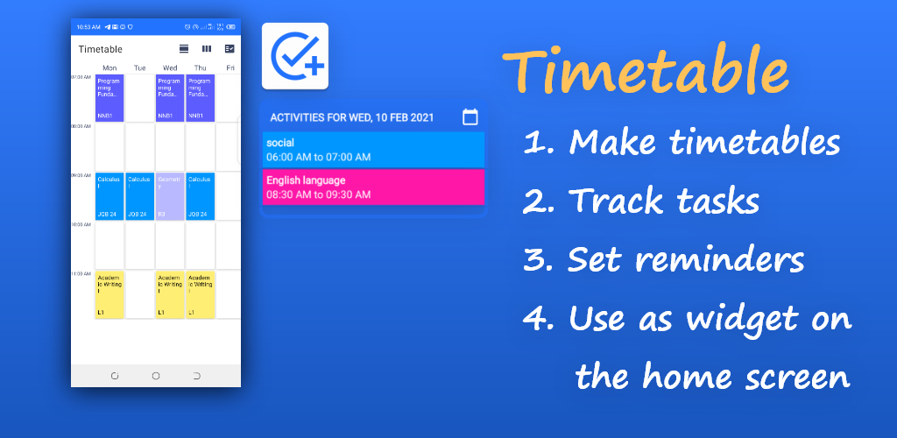

# Timetable
Timetable is a simple app for scheduling personal activities. The mobile app is built using android studio, native Android SDK, and Java programming language.



## Language and Libraries
- Java
- Native Android SDK

## Installation
Clone the repository and open it in android studio.
```bash
git clone https://github.com/dodziraynard/timetable.git
```

## Running
Just run/build the project in android studio!

## More screenshots
```bash
cd ./screenshots
```

[Here](app/release/app-release.apk) is the release built (apk) of the app.